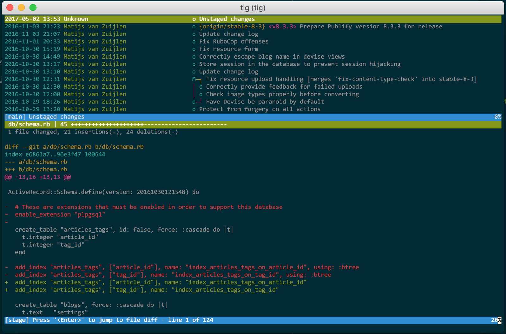

# TigTime

Welcome to TigTime, 
a baby repo with the soul goal of introducing you to
[Tig](https://github.com/jonas/tig)

## A curses frontend to Git

Tig is a comprehensive ncurses-based text-based Git interface made by [Jonas Fonseca](https://github.com/jonas). 
That allows you to navigate through branches and commits, to view merges and rebases, or even compare different branches before applying a merge.

[Installation instructions found here](https://jonas.github.io/tig/INSTALL.html).
Tig is currently functional on: 
OS X through [Homebrew](https://brew.sh/)
Linux with the aid of [Nix](https://nixos.org/nix/)
and
Windows with the help of [Cygwin](https://www.cygwin.com/)

[Tig docs found here](https://jonas.github.io/tig/)